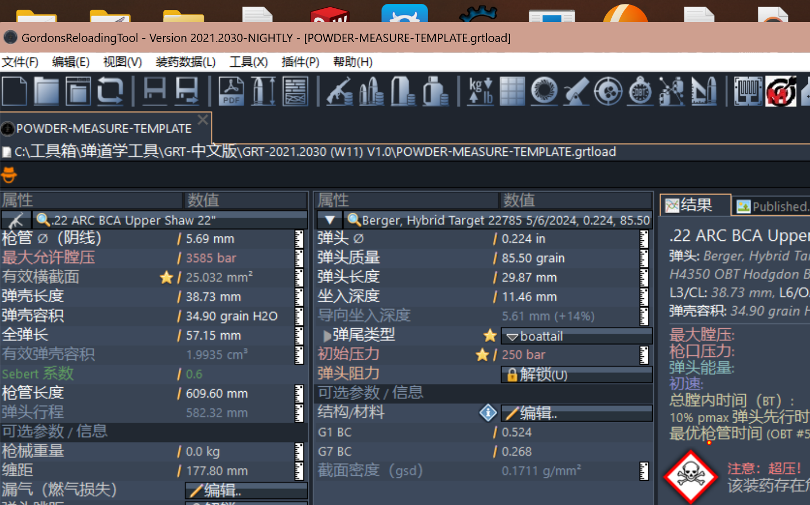

# GordonsReloadingTool (GRT) 中文补丁 / Chinese Localization Patch

[_V1.0-blue)](https://www.grtools.de)

为内弹道仿真软件 **GordonsReloadingTool (GRT)** 制作的简体中文汉化补丁。

> GRT 是一款优秀的自由软件（免费但非开源），作者 Gordon 已不幸离世，软件停止更新、濒临失传。
> 本仓库旨在为中文用户保存并延续这份工具的使用体验。愿逝者安息，软件长存。

## 适用版本

- **GordonsReloadingTool 2021.2030 (W11) V1.0**（请务必确认版本一致）
- 其他 2021.x 版本原则上兼容（语言包按符号键匹配，缺失条目自动回退英文），
  但未逐一测试。

## 安装方法

1. 下载本仓库（Code → Download ZIP，或 `git clone`）
2. 将压缩包内的 `locales/`、`plugins/`、`doku/` 三个文件夹复制粘贴到 **GRT 主目录**
   （即 `GordonsReloadingTool.exe` 所在目录），选择"替换目标中的文件"
3. 启动 GRT —— 中文系统下界面自动切换为中文

> 手动切换语言：菜单 `视图 → 更改界面语言..`（更改后需重启 GRT）。
> GRT 启动时会自动扫描 `locales/*.mo` 语言包并按操作系统语言选择。

## 汉化内容

| 组件 | 文件 | 说明 |
|---|---|---|
| 主程序界面（2802 个字符串键） | `locales/zh.mo` | 菜单、全部窗口、警告框、图表标签 |
| GRTrace 测速插件 | `plugins/GRTrace/locales/zh.mo` | 244 条 |
| Miller 稳定性插件 | `plugins/MillerStability/Resources/zh.mo` | 70 条 |
| 插件菜单清单 | `plugins/*/com.grt.plugin.xml` | 插件菜单/工具栏文案 |
| 应用内帮助文档 | `doku/zh/`（99 页 + 全套图片） | 使用手册、FAQ、报告模板说明、DokuWiki 语法 |

## 有意保留英文的内容（按行业惯例）

- 数据库中的弹种名、发射药商品名（`.308 Win`、`Vihtavuori N560` 等）——专有名词
- 计量单位符号与标准缩写（grain、bar、Pmax、v0、OAL、OBT、ES、SD、BC、CIP、SAAMI、UBCS）
- **注意**：Trajectory 外弹道插件窗口内的英文未包含在本补丁中（其汉化需修改插件
  exe 本体，出于许可能否公开分发的考虑暂不随仓库分发）

## 回滚 / 卸载

- 删除 `locales/zh.mo`、`plugins/GRTrace/locales/zh.mo`、
  `plugins/MillerStability/Resources/zh.mo` 三个文件即可恢复英文界面
- 覆盖过的两个 `com.grt.plugin.xml` 可从原版安装包还原

## 许可 / License

- **GordonsReloadingTool 程序本体及其文档**版权归 **GORDONS RELOADING CHANNEL**
  所有，本仓库随附原始许可文件（[LICENSE.TXT](LICENSE.TXT) / 德文原版
  [LIZENZ.TXT](LIZENZ.TXT)）。原程序许可允许在保留全部版权与产品说明的前提下
  传递程序副本。
- **翻译文件**（`*.mo`、`doku/zh/` 译文）在此仅以保存与学习为目的发布。
- 本仓库不含、也不分发任何 GRT 程序本体；请在官方渠道获取原程序。
- 仅供学习交流使用，请勿用于商业用途。
